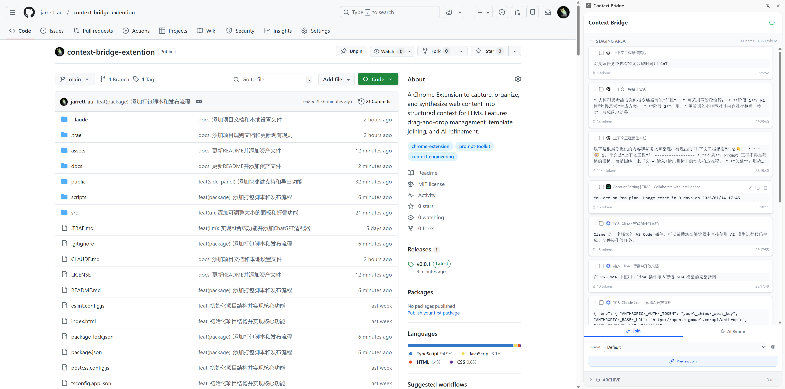
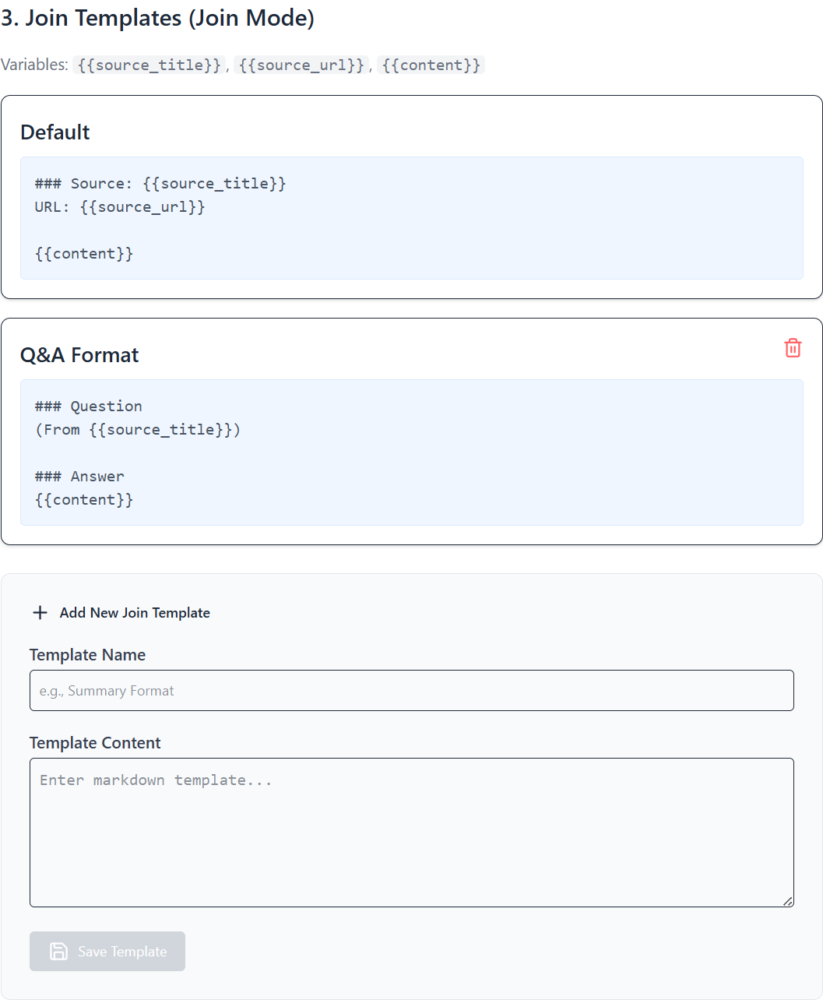
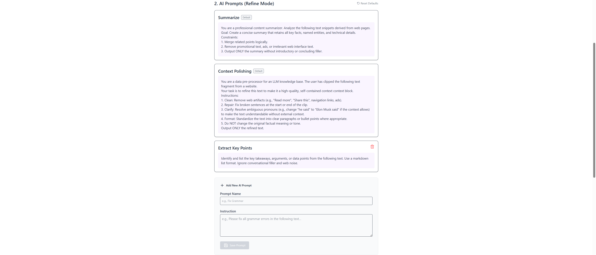

# Context Bridge Extension

Context Bridge is a Chrome Extension designed to help users bridge the gap between web content and LLMs (Large Language Models). It allows you to capture, organize, and synthesize web clips into structured context for AI interactions.



## Features

- **📸 Capture**: Extract content from any webpage (with special adapters for ChatGPT, etc.) using a simple overlay.
- **🗂️ Organize**: Manage your clips in a Side Panel.
  - **Drag & Drop**: Reorder clips easily.
  - **Flexible Layout**: Resizable Staging and Archive areas with collapsible headers.
  - **Shortcuts**: `Ctrl+I` to toggle the Side Panel instantly.
  - **Staging & Archive**: Keep your workspace clean.
- **🔗 Synthesize**:
  - **Join Mode**: Concatenate multiple clips using customizable Markdown templates.
    
  - **AI Refine Mode**: Use LLMs (OpenAI compatible) to summarize, polish, or extract insights from your clips.
    
- **⚙️ Configurable**:
  - Custom Join Templates.
  - Custom AI Prompts.
    
  - OpenAI-compatible API settings (Base URL, Model, API Key).

## Tech Stack

- **Framework**: React 19, Vite, TypeScript
- **UI**: TailwindCSS, Lucide React, Framer Motion
- **State Management**: Zustand
- **Drag & Drop**: @dnd-kit
- **Browser API**: Chrome Extension Manifest V3 (Side Panel, Storage, Scripting)
- **AI Integration**: OpenAI SDK (Customizable Base URL)

## Development

1. **Install Dependencies**
   ```bash
   npm install
   ```

2. **Build**
   ```bash
   npm run build
   ```

3. **Package for Release**
   ```bash
   npm run package
   ```
   This will create a `.zip` file in the `releases/` directory.

4. **Load in Chrome**
   - Open `chrome://extensions/`
   - Enable "Developer mode"
   - Click "Load unpacked"
   - Select the `dist` directory (for development) or unzip the release file and select the folder.

## Usage

1. **Capture**: Click the extension icon or use the shortcut to activate the capture overlay on any page. Select the text or element you want to clip.
2. **Side Panel**: Press `Ctrl+I` or click "Open Side Panel" to activate.
3. **Manage**: 
   - Drag clips to reorder.
   - Drag the boundary between Staging and Archive to resize.
   - Click section headers to collapse/expand.
4. **Synthesize**:
   - Select clips in the Staging Area.
   - Choose "Join" to merge them with a template.
   - Choose "AI Refine" to process them with an LLM (requires API Key).

## Configuration

Go to the Extension Options page to:
- Set up your OpenAI API Key and Base URL.
- Manage Join Templates (e.g., specific formats for source citation).
- Manage AI Prompts (e.g., "Summarize", "Translate", "Code Extraction").

## License

MIT
